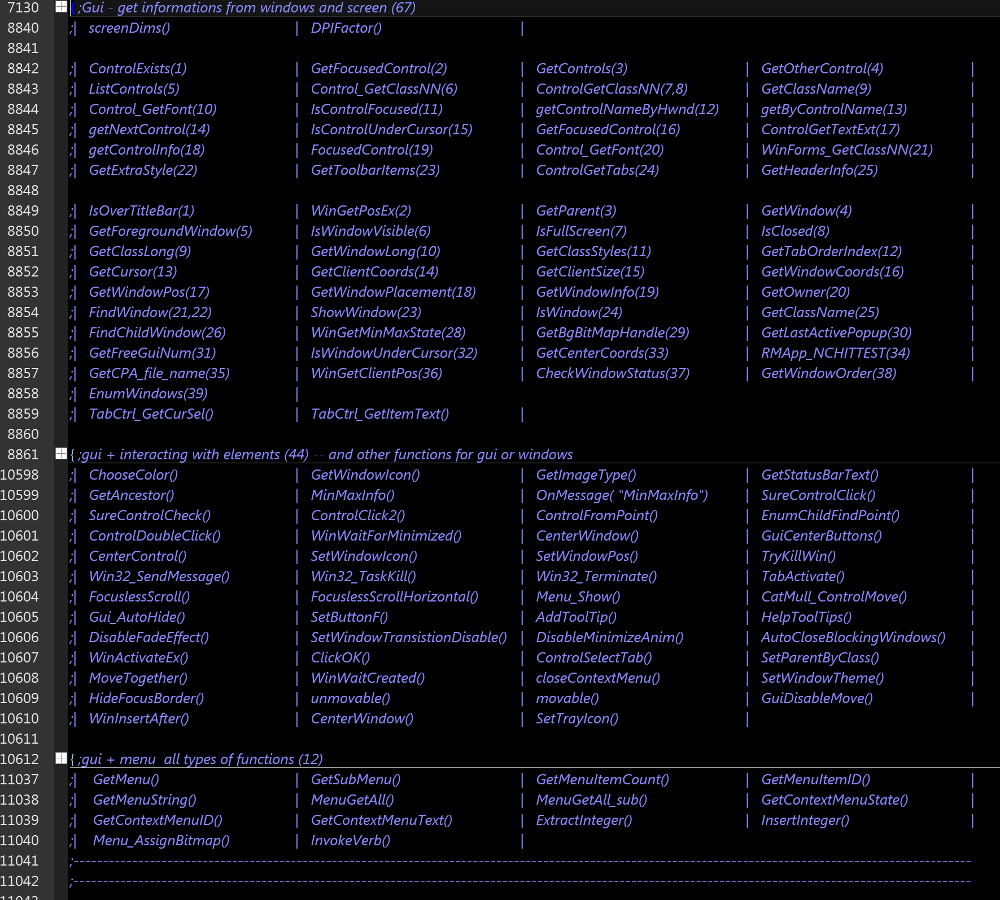

------

**AHK-Rare** - *collection of rare or very useful single functions* 

This is a collection of functions I found at Autohotkey-Forum or inside Autohotkey Scripts. Sometimes you will find one of it an official Autohotkey-Library. Approximately 90-95% of the functions can not be found in any of the 1000 libraries that I have also put together here at Github.

Some of the collected function seems to be multiple in this collection, because they sometimes use very different methods. This is a crucial difference. You wan’t find “THE ONLY ONE” good function here. Take what is the better right now! From that I build up a script individual library.

----

*Last modification date*: ***15.12.2018***, *Changes are below!* *At the end*: complete list of all functions. The functions are sorted by topic as shown in the picture. *Remark*: I didn’t tested all functions and sorting is very different.

In the [AHK forum](https://autohotkey.com/boards/) I read that "Codefolding does not work". After trying it with [Sublime Text Editor](https://www.sublimetext.com) I noticed that Sublime does not natively support codefolding via the syntax **;{** , **;}**. Maybe that's the problem. The collection was created with [Scite4Autohotkey](https://github.com/fincs/SciTE4AutoHotkey). 

------




##  [XX-XXXXXXX-XXXX] - XX(new)+564(old) =  XXX

| FUNCTION                      | DESCRIPTION                                                  |
| :---------------------------- | :----------------------------------------------------------- |
| **ExtratIcon()**              | extract icon from a resource file                            |
| **GetIconSize()**             | determines the size of the icon (Lexikos function)           |
| **Gdip_GetHICONDimensions()** | get icon dimensions                                          |
| **FoxitInvoke()**             | wm_command wrapper for FoxitReader Version:  9.1             |
| **WinSaveCheckboxes()**       | save the status of checkboxes in other apps                  |
| **GetButtonType()**           | uses the style of a button to get it’s name                  |
| **KeyValueObjectFromLists()** | merge two lists into one key-value object, useful for 2 two lists you retreave from WinGet |
| **List2Array()**              | function uses StrSplit () to return an array                 |
| **CRC32()**                   | CRC32 function, uses MCode                                   |
| **MeasureText()**             | Measures the single-line width and height of the passed text |
| **Gdip_BitmapReplaceColor()** | using Mcode to replace a color with a specific variation     |
| **Gdi_ExtFloodFill()**        | fills an area with the current brush                         |
| **Gdip_AlphaMask32v1()**      | 32bit Gdip-AlphaMask with MCode - one of two builds          |
| **Gdip_AlphaMask32v2()**      | 32bit Gdip-AlphaMask with MCode  - second of two builds      |
| **Gdip_AlphaMask64()**        | 64bit Gdip-AlphaMask with MCode                              |
| **CircleCrop()**              | gdi circlecrop with MCode                                    |
| **ExploreObj()**              | renewed function to print contents of an object              |
| **PIDfromAnyID()**            | for easy retreaving of process ID’s (PID)                    |


## [15-December-2018] - 22(new)+542(old) = 564

optimized layout, began to assign a number for functions identification, Split topics to find functions faster, each function will get the following description* over time:

```Autohotkey
/*    	DESCRIPTION of function 
    	----------------------------------------------------------------------------
		Description  	:	
		Link           	:	
		Author         	:	
		Date           	:	
		AHK-Version 	:	
		License        	:	
		Parameter(s)	:
		Return value	:
		Remark(s)    	:	
		Dependencies	:	
		KeyWords    	:	
    	----------------------------------------------------------------------------
*/
```

**in preparation for a comfortable search and editing program*.


- **Ansi2Oem()** - using Ansi2Unicode and Unicode2Ansi functions
- **Oem2Ansi()** - using Ansi2Unicode and Unicode2Ansi functions
- **Ansi2UTF8()** - using Ansi2Unicode and Unicode2Ansi functions
- **UTF82Ansi()** - using Ansi2Unicode and Unicode2Ansi functions
- **FindChildWindow()** - ***new version!*** - If there was no title or text for the childwindow, the returned value was empty, so this function can handle now a new search parameter  -Class or ClassNN-
- **StdoutToVar_CreateProcess()** - Runs a command line program and returns its output
- **DNSQuery()** - retrieve IP adresses or host/domain names from DNS
- **CreateDIB()** - a wonderfull function by SKAN to draw tiled backgrounds (like chess pattern) to a gui, it can also draw gradients
- **GuiControlLoadImage()** - scale down a picture to fit the given width and height of a picture control
- **Gdip_ResizeBitmap()** - returns resized bitmap
- **Gdip_CropBitmap()** - returns cropped bitmap. Specify how many pixels you want to crop (omit) from each side of bitmap rectangle
- **FontClone()** - backup hFont in memory for further processing
- **GuiDefaultFont()** - returns the default Fontname & Fontsize
- **DateDiff()** - returns the difference between two timestamps in the specified units
- **ObjectNameChange()** - titlebar hook to detect when title changes, (Lexikos’ code)
- **StrGetDimAvgCharWidth()** - average width of a character in pixels
- **BlockKeyboard()** - block keyboard, and unblock it through usage of keyboard
- **GetFileFormat()** - retreaves the codepage format of a file
- **RunUTF8()** - if a .exe file really requires its command line to be encoded as UTF-8, the following might work (a lexikos function)
- **Is64bitProcess()** - check if a process is running in 64bit
- **getSessionId()** - this functions finds out ID of current session
- **SetTrayIcon()** - sets a hex coded icon to as try icon
- **HashFile()** - calculate hashes (MD2,MD5,SH1,SHA256, SHA384, SHA512) from file ;23


##  [30-September-2018] count: 140+402 = 542 functions

### **functions for controls** (10)

- **ControlGetClassNN()** - different method is used here in compare to the already existing functions in this collection
- **FocusedControl()** - returns the HWND of the currently focused control, or 0 if there was a problem**
- **GetClassName()** - returns HWND‘s class name without its instance number, e.g. “Edit” or “SysListView32”
- **ControlSelectTab()** - SendMessage wrapper to select the current tab on a MS Tab Control.
- **ClickOK()** - function that search for any button in a window that might be an ‘Ok’ button to close a window dialog
- 4 different **AddToolTip() functions** - very easy to use function to add a tooltip to a control
- **Control_GetFont()** - retrieves the used font of a control


### **networking and Internet** (9)

- **HostToIp()** - gets the IP address for the given host directly using the WinSock 2.0 dll, without using temp files or third party utilities

- **LocalIps()** - with small changes to HostToIP() this can be used to retrieve all LocalIP‘s

- **IE_TabActivateByHandle()** - activates a tab by hwnd in InternetExplorer

- **IE_TabWinID()** - find the HWND of an IE window with a given tab name

- **GetAdaptersInfo()** - GetAdaptersAddresses function & IP_ADAPTER_ADDRESSES structure

- **Color_RGBtoHSV()** - converts beetween color two color spaces: RGB -> HSV

- **Color_HSVtoRGB()** - converts beetween color two color spaces: HSV -> RGB

- **ACCTabActivate()** - activate a Tab in IE - function uses acc.ahk library

- **TabActivate()** - a different approach to activate a Tab in IE - function uses acc.ahk library


### **Strings search and handling** (5)

- **CleanLine()** - Return a line with leading and trailing spaces removed, and tabs converted to spaces

- **StrTrim()** - Remove all leading and trailing whitespace including tabs, spaces, CR and LF

- **GetWordsNumbered()** - gives back an array of words from a string, you can specify the position of the words you want to keep

- **PrintArr()** - show values of an array in a listview gui for debugging

- **StrDiff()** - SIFT3 : Super Fast and Accurate string distance algorithm


### **more ListView functions** (19)

- **LV_SubitemHitTest()** - get‘s clicked column in listview

- **LV_EX_FindString()** - find an item in any listview , function works with ANSI and UNICODE (tested)

- **LV_RemoveSelBorder()** - remove the listview‘s selection border

- **LV_SetExplorerTheme()** - set ‘Explorer’ theme for ListViews & TreeViews on Vista+

- **LV_Update()** - update one listview item

- **LV_RedrawItem()** - this one redraws on listview item

- **LV_SetExStyle()** - set / remove / alternate extended styles to the listview control

- **LV_GetExStyle()** - get / remove / alternate extended styles to the listview control

- **LV_IsItemVisible()** - determines if a listview item is visible

- **LV_SetIconSpacing()** - Sets the space between icons in the icon view

- **LV_GetIconSpacing()** - Get the space between icons in the icon view

- **LV_GetItemPos()** - obtains the position of an item

- **LV_SetItemPos()** - set the position of an item

- **LV_MouseGetCellPos()** - returns the number (row, col) of a cell in a listview at present mouseposition  

- **LV_GetColOrderLocal()** - returns the order of listview columns for a local listview

- **LV_GetColOrder()** - returns the order of listview columns for a listview

- **LV_SetColOrderLocal()** - pass listview hWnd (not listview header hWnd)

- **LV_GetCheckedItems()** - Returns a list of checked items from a standard ListView Control

- **LV_ClickRow()** - simulates a left mousebutton click on a specific row in a listview


### **functions to deal with windows** (22)

- **WinActivateEx()** - Activate a Window, with extra Error Checking and More Features

- **AutoCloseBlockingWindows()** - close all open popup (childwindows), without knowing their names, of a parent window

- **SetParentByClass()** - set parent window by using its window class

- **MoveTogether()** - move 2 windows together - using DllCall to DeferWindowPos

- **SetWindowTheme()** - set Windows UI Theme by window handle

- **HideFocusBorder()** - hides the focus border for the given GUI control or GUI and all of its children

- **WinWaitCreated()** - Wait for a window to be created, returns 0 on timeout and ahk_id otherwise

- **closeContextMenu()** - a smart way to close a context menu

- **CheckWindowStatus()** - check’s if a window is responding or not responding (hung or crashed) - 

- **GuiDisableMove()** - to fix a gui/window to its coordinates

- **WinInsertAfter()** - insert a window after a specific window handle

- **GetWindowOrder()** - determines the window order for a given (parent-)hwnd 

- **EnumWindows()** - Get a list with all the top-level windows on the screen or controls in the window

- **CenterWindow()** - center a window or set position optional by using Top, Left, Right, Bottom or a combination of it

- **MouseGetText()** - get the text in the specified coordinates, function uses Microsoft UIA

- **unmovable()** - makes Gui unmovable

- **movable()** - makes Gui movable

- **A_DefaultGui()** - a nice function to have a possibility to get the number of the default gui

- **GetInfoUnderCursor()** - retreavies ACC-Child under cursor

- **GetAccPath()** - get the Acc path from (child) handle

- **GetEnumIndex()** - for Acc child object

- **enumChildCallback()** - i think this retreave’s the child process ID for a known gui hwnd and the main process ID


### **File System** (6)

- **GetFileAttributes()** - get attributes of a file or folder

- **SetFileTime()** - to set the time

- **SetFileAttributes()** - set attributes of a file or folder

- **FileSetSecurity()** -  set security for the file / folder

- **FileSetOwner()** - set the owner to file / directory

- **FileGetOwner()** - get the owner to file / director


### **Graphic/GDI Functions** (6)

- **GDI_GrayscaleBitmap()** - Converts GDI bitmap to 256 color GreyScale

- **Convert_BlackWhite()** - Convert exist imagefile to black&white , it uses machine code

- **getHBMinfo()**

- **SaveHBITMAPToFile()** - saves the hBitmap to a file

- **DrawRotatePictureOnGraphics()** - rotate a pBitmap

- **CopyBitmapOnGraphic()** - copy a pBitmap of a specific width and height to the Gdip graphics container (pGraphics)


### **ClipBoard Functions** (9)

- **ClipboardGetDropEffect()** - Clipboard function. Retrieves if files in clipboard comes from an explorer cut or copy operation.

- **ClipboardSetFiles()** - Explorer function for Drag&Drop and Pasting. Enables the explorer paste context menu option.

- **CopyFilesToClipboard()** - copy files to clipboard

- **FileToClipboard()** - copying the path to clipboard

- **FileToClipboard()** - a second way to copying the path to clipboard

- **ImageToClipboard()** - Copies image data from file to the clipboard. (first of three approaches)

- **Gdip_ImageToClipboard()** - Copies image data from file to the clipboard. (second approach)

- **Gdip_ImageToClipboard()** - Copies image data from file to the clipboard. (third approach)

- **AppendToClipboard()** - Appends files to CF_HDROP structure in clipboard


### **memory functions** (19)

- **ReadProcessMemory()** - reads data from a memory area in a given process.

- **WriteProcessMemory()** - writes data to a memory area in a specified process. the entire area to be written must be accessible or the operation will fail

- **CopyMemory()** - Copy a block of memory from one place to another 

- **MoveMemory()** - moves a block memory from one place to another

- **FillMemory()** - fills a block of memory with the specified value

- **ZeroMemory()** - fills a memory block with zeros

- **CompareMemory()** - compare two memory blocks

- **VirtualAlloc()** - changes the state of a region of memory within the virtual address space of a specified process. the memory is assigned to zero.AtEOF

- **VirtualFree()** - release a region of pages within the virtual address space of the specified process 

- **ReduceMem()** - reduces usage of memory from calling script 

- **GlobalLock()** - memory management function

- **LocalFree()** - free a locked memory object

- **CreateStreamOnHGlobal()** - creates a stream object that uses an HGLOBAL memory handle to store the stream contents. This object is the OLE-provided implementation of the IStream interface.

- **CoTaskMemFree()** - releases a memory block from a previously assigned task through a call to the CoTaskMemAlloc () or CoTaskMemAlloc () function.

- **CoTaskMemRealloc()** - change the size of a previously assigned block of working memory

- **VarAdjustCapacity()** - adjusts the capacity of a variable to its content

- **GetUIntByAddress()** - get UInt direct from memory. I found this functions only within one script 

- **SetUIntByAddress()** - write UInt direct to memory

- **RtlUlongByteSwap64()** - routine reverses the ordering of the four bytes in a 32-bit unsigned integer value (2 functions for AHK v1 und AHK v2)


### **Systeminformations** (7)

- **GetPhysicallyInstalledSystemMemory()** - recovers the amount of RAM in physically installed KB from the SMBIOS (System Management BIOS) firmware tables, WIN_V SP1+

- **GlobalMemoryStatus()** - retrieves information about the current use of physical and virtual memory of the system

- **GetSystemFileCacheSize()** - retrieves the current size limits for the working set of the system cache

- **DriveSpace()** - retrieves the DriveSpace

- **RtlGetVersion()** - retrieves version of installed windows system

- **UserAccountsEnum()** - list all users with information

- **GetCurrentUserInfo()** - obtains information from the current user


### **Font handling** (3)

- **FontEnum()** - enumerates all uniquely-named fonts in the system that match the font characteristics specified by the LOGFONT structure

- **GetFontTextDimension()** - calculate the height and width of the text in the specified font 

- **GetFontProperties()** - to get the current font‘s width and height


### **converting functions** (8)

- **RadianToDegree()** - convert radian (rad) to degree 

- **DegreeToRadian()** - convert degree to radian (rad)

- **RGBToARGB()** - convert RGB to ARGB

- **ARGBToRGB()** - convert ARGB to RGB.

- **JEE_HexToBinData()** - hexadecimal to binary

- **JEE_BinDataToHex()** - binary to hexadecimal 

- **JEE_BinDataToHex2()** - binary to hexadecimal2

- **DllListExports()** - List of Function exports of a DLL


### **functions for different purposes** (17)

- **pauseSuspendScript()** - function to suspend/pause another script

- **GetCommState()** - this function retrieves the configuration settings of a given serial port

- **Hotkeys()** - a handy function to show all used hotkeys in script

- **ColoredTooltip()** - show a tooltip for a given time with a custom color in rgb format (fore and background is supported). This function shows how to obtain the hWnd of the tooltip.

- **PostMessageUnderMouse()** - Post a message to the window underneath the mouse cursor, can be used to do things involving the mouse scroll wheel

- **GetBinaryType()** - determines the bit architecture of an executable program

- **SetRestrictedDacl()** - run this in your script to hide it from Task Manager

- **type(v)** - Object version: Returns the type of a value: “Integer”, “String”, “Float” or “Object” by Lexikos

- **type(ByRef v)** - COM version: Returns the type of a value: “Integer”, “String”, “Float” or “Object” by Lexikos

- **Time()** - calculate with time, add minutes, hours, days - add or subtract time

- **WM_SETCURSOR()** - Prevent “sizing arrow” cursor when hovering over window border

- **getActiveProcessName()** - this function finds the process to the ‘ForegroundWindow’

- **GetHandleInformation()** - obtain certain properties of a HANDLE

- **SetHandleInformation()** - establishes the properties of a HANDLE

- **InvokeVerb()** - executes the context menu item of the given path


##  [15-July-2018] count: 79+323 = 402 functions

I’ve found a lot function this time. I checked the found functions that these can not actually be found in any library, so that these can really be called "Rare". I added some more descriptions, examples, links and moved some functions to the right category. 

---------

***** changing the signs to default code folding signs. I changed **;{** to **{ ;** and **;}** to **}**. I hope it will work in most cases and most code editors.  

-------------

####*+added new section:* RegEx - Strings - useful strings for RegExMatch or Replace

- **2 RegEx strings to find AHK-functions** - not tested yet

  ### Strings/Arrays/Objects/Text/Variables

- **StrCount()** - a very handy function to count a needle in a Haystack

- **SuperInstr()** - Returns min/max position for a | separated values of Needle(s)

- **GetText()** - copies the selected text to a variable while preserving the clipboard.(Ctrl+C method)

- **PutText()** - Pastes text from a variable while preserving the clipboard. (Ctrl+v method)

- **GetFuncDefs()** - get function definitions from a script

- **ExploreObj()** - returns a string containing the formatted object keys and values (very nice for debugging!)

- **LineDelete()** - deletes lines of text from variables / no loop

- **ExtractFuncTOuserAHK()** - extract user function and helps to write it to userAhk.api

- **PdfToText()** - copies a selected PDF file to memory - it needs xpdf - pdftotext.exe

- **PdfPageCounter()** - counts pages of a pdffile (works with 95% of pdf files)

- **PasteWithIndent()** - paste string to an editor with your prefered indent key

- **SplitLine()** - split string to key and value

- **Ask_and_SetbackFocus()** - by opening a msgbox you lost focus and caret pos in any editor - this func will restore the previous positions of the caret

- **Valueof()** - Super Variables processor by Avi Aryan, overcomes the limitation of a single level ( return %var% ) in nesting variables

  ### Windows/Gui

- **WinSetPlacement()** - Sets window position using workspace coordinates (-> no taskbar)

- **AttachToolWindow()** - Attaches a window as a tool window to another window from a different process. 

- **DeAttachToolWindow()** - removes the attached ToolWindow

- **GetFreeGuiNum()** - gets a free gui number

- **DisableFadeEffect()** - disabling fade effect on gui animations

- **RMApp_NCHITTEST()** - Determines what part of a window the mouse is currently over

- **SetWindowTransistionDisable()** - disabling fade effect only for the window of choice 

- **IsWindowUnderCursor()** - Checks if a specific window is under the cursor.

- **GetCenterCoords()** - ?center a gui between 2 monitors?

- **Menu_AssignBitmap()** - assign bitmap to any item in any AHk menu

- **guiMsgBox()** - GUI Message Box to allow selection

- **DisableMinimizeAnim()** - disables or restores original minimize anim setting

- **GetTextSize()** - a corrected version of this function from majkinetor *(tested)*

- **MeasureText()** - alternative to other functions which calculate the text size before display on the screen

- **WinGetClientPos()** - gives back the coordinates of client area inside a gui/window - with DpiFactor correction

- **winfade()** - another winfade function

- **TT_Console()** - Use Tooltip as a User Interface it returns the key which has been pressed

- **ToolTipEx()** - Display ToolTips with custom fonts and colors

- **SafeInput()** - makes sure sure the same window stays active after showing the InputBox. Otherwise you might get the text pasted into another window unexpectedly.

- **CreateFont()** - creates font in memory which can be used with any API function accepting font handles

- **GetHFONT()** - gets a handle to a font used in a AHK gui for example

- **MsgBoxFont()** - style your MsgBox with with your prefered font

- **DisableCloseButton()** - to disable/grey out the close button

  ### Listview

- **LV_HeaderFontSet()** - sets a different font to a Listview header (it's need CreateFont() function) - formerly this function needs a function as a rewrite of SendMessage, I changed it to a DLLCall without an extra function, the depending function *CreateFont()* can be also found in this file

- **LV_Find()** - I think it‘s usefull to find an item position a listview

- **LV_GetSelectedText()** - returns text from selected rows in ListView (in a user friendly way IMO.)

- **LV_Notification()** - easy function for showing notifications by hovering over a listview

- **LV_IsChecked()** - alternate method to find out if a particular row number is checked

- **LV_SetCheckState()** - check (add check mark to) or uncheck (remove the check mark from) an item in the ListView control

- **LV_SetItemState()** - with this function you can set all avaible states to a listview item

  ### Controls

- **ControlDoubleClick()** - simulates a double click on a control with left/middle or right mousebutton

- **GetFocusedControl()** - get focused control from active window -multi Options[ClassNN \ Hwnd \ Text \ List \ All] available 

- **ControlGetTextExt()** - 3 different variants are tried to determine the text of a control

- **getControlInfo()** - get width and heights of controls

- **ControlSetTextAndResize()** - set a new text to a control and resize depending on textwidth and -height

- **GetCPA_file_name()** - retrieves Control Panel applet icon

- **IsControlUnderCursor()** - Checks if a specific control is under the cursor and returns its ClassNN if it is

  ### Other

- **TaskList()** - list all running tasks (no use of COM)
- **ResConImg()** - Resize and convert images. png, bmp, jpg, tiff, or gif 
- **ReleaseModifiers()** - helps to solve the Hotkey stuck problem
- **isaKeyPhysicallyDown()** - belongs to ReleaseModifiers() function
- **CreateCircleProgress(s)** - very nice to see function for a circle progress
- **IndexOfIconResource()** - function is used to convert an icon resource id (as those used in the registry) to icon index(as used by ahk)
- **GetIconforext()** - Gets default registered icon for an extension
- **IsConnected()** - Returns true if there is an available internet connection
- **RGBrightnessToHex()** - transform rbg (with brightness) values to hex 
- **GetHueColorFromFraction()** - get hue color from fraction. example: h(0) is red, h(1/3) is green and h(2/3) is blue (345)
- **MouseDpi()** - Change the current dpi setting of the mouse
- **GetProcessName()** - Gets the process name from a window handle.
- **GetDisplayOrientation()** - working function to get the orientation of screen
- **FileCRC32()** - Computes and returns CRC32 hash for a File passed as parameter
- **FindFreeFileName()** - Finds a non-existing filename for Filepath by appending a number in brackets to the name
- **ToggleSystemCursor()** - choose a cursor from system cursor list
- **GetSysErrorText()** - method to get meaningful data out of the error codes
- **getSysLocale()** - gets the system language 
- **URLPrefGui()** - shimanov‘s workaround for displaying URLs in a gui
- **ReadProxy()** - reads the proxy settings from the windows registry
- **CountFilesR()** - count files recursive in specific folder (uses COM method)
- **CountFiles()** - count files in specific folder (uses COM method)
- **GetThreadStartAddr()** - returns start adresses from all threads of a process
- **FormatFileSize()** - Formats a file size in bytes to a human-readable size string
- **SendToAHK()** - Sends strings by using a hidden gui between AHK scripts
- **ReceiveFromAHK()** - Receiving strings from SendToAHK
- **PathInfo()** - splits a given path to return as object

-----
##  [13-June-2018] count: 323 functions

- **TimedFunction()** - SetTimer functionality for functions
- **ListGlobalVars()** - ListGlobalVars() neither shows nor activates the AutoHotkey main window, it returns a string
- **HelpToolTips()** -  To show defined GUI control help tooltips on hover.
- **StringM()** -  String manipulation with many options is using RegExReplace  (bloat, drop, Flip, Only, Pattern, Repeat, Replace, Scramble, Split)
- **FileWriteLine()** -  To write data at specified line in a file.
- **FileMD5()** - File MD5 Hashing
- **StringMD5()** - String MD5 Hashing
- **Dec2Base()** - Base to Decimal and 
- **Base2Dec()** - Decimal to Base conversion
- **InjectDll()** - injects a dll to a running process (ahkdll??)
- **HexToFloat()** - Hexadecimal to Float conversion
- **FloatToHex()** - Float to Hexadecimal conversion
- **CalculateDistance()** - calculates the distance between two points in a 2D-Space 
- **IsInRange()** - shows if a second variable is in range
- **GetRange()** - another good screen area selection function
- **GetComboBoxChoice()** - Combobox function
- **LB_AdjustItemHeight()** - Listbox function
- **LB_GetItemHeight()** - Listbox function
- **LB_SetItemHeight()**- Listbox function
- **GetClientSize()** - get size of window without border

----
##  [10-June-2018] count: 303 functions

*minor layout improvement (so I hope, anyway). In the [AHK forum](https://autohotkey.com/boards/) I read that codefolding does not work. After trying with the [Sublime Text Editor](https://www.sublimetext.com) I noticed that Sublime does not natively support codefolding via the syntax **;{** , **;}**. Maybe that's the problem. The collection was created with  [Scite4Autohotkey](https://github.com/fincs/SciTE4AutoHotkey).*

- **ChangeMacAdress()** - change MacAdress, it makes changes to the registry!
- **ListAHKStats()** - Listvars with select desired section: ListLines, ListVars, ListHotkeys, KeyHistory
- **LV_MoveRow()** - the same like above, but slightly different. With integrated script example
- **AddToolTip()** - Add/Update tooltips to GUI controls
- **ExtractTableData()** - extracts tables from HTML files
- **MouseExtras()** - Allows to use subroutines for Holding and Double Clicking a Mouse Button.
- **CaptureScreen()** - screenshot function 4 - orginally from CaptureScreen.ahk
- **CaptureCursor()** - this captures the cursor, depending function of CaptureScreen()
- **Zoomer()** - zooms a HBitmap, depending function of CaptureScreen()
- **SaveHBITMAPToFile()** - saves a HBitmap to a file, depending function of CaptureScreen()

-----
##  [02-June-2018] count: 293 functions

***6 functions removed*** - depending functions not available or the functions are doubled, ***added some links*** to the sources of ***origin*** of the functions. As far as findable some feature ***descriptions and example scripts added***.

- **LV_SetBackgroundURL()** - set a ListView's background image
- **GetBgBitMapHandle()** - returns the handle of a background bitmap in a gui
- **CreatePatternBrushFrom()** - can be used to repeat a pattern as background image in a gui
- **GetLastActivePopUp()** - passes the handle of the last active pop-up window of a parent window
- **Convert()** - converts ImageFiles
- **GUI_AutoHide()** - Autohide the GUI function
- **DeskIcons()** - i think its for showing all desktop icons
- **WinFadeToggle()**
- **KilProcess()** - uses DllCalls to end a process
- **ConsoleSend()** - Sends text to a console's input stream
- **StdOutStream()** - Store command line output in autohotkey variable. Supports both x86 and x64.
- **LV_MoveRow()** - moves a listview row up or down
- **SetButtonF()** - Set a button control to call a function instead of a label subroutine 
- **GetScriptVARs()** - returns a key, value array with all script variables (e.g. for debugging purposes)
- **GetAllInputChars()** - Returns a string with input characters
- **LoadScriptResource()** - loads a resource into memory (e.g. picture, scripts..)
- **HIconFromBuffer()** - function provides a HICON handle e.g. from a resource previously loaded into memory (LoadScriptResource)
- **hBMPFromPNGBuffer()** - Function provides a hBitmap handle e.g. from a resource previously loaded into memory (LoadScriptResource)
- **getNextControl()** - I'm not sure if this function works could be an AHK code for the Control.GetNextControl method for System.Windows.Forms
- **SaveSetColours()** - Sys colours saving adapted from an approach found in Bertrand Deo's code

-----
##  [28-May-2018] count: 280 functions

***Organized layout***, some functions moved to the right topic, delete duplicate functions, adding more info and examples*

***Functionlist to Markdown.ahk*** - my script to handle the Markdown table output for this page. It's not a dynamic script! The output depends from the following syntax: 

```Autohotkey
SystemCursor(OnOff=1) {  							;-- hiding mouse cursor
```

-> it search for '**(**' followed by a '**;--**' , then it recognized it as a function, it uses the comment as short description

-> it ignores all functions without '**;--**' or functions that marked with '**;{ sub**' at the beginning and '**;}**' at the end:

```Autohotkey
;{ sub
;If [var] in [ .. ]
InVar(Haystack, Needle, Delimiter := ",", OmitChars := "") {
	Loop, Parse, % Needle, %Delimiter%, %OmitChars%
		if (A_LoopField = Haystack)
			return 1
	return 0
}

IsWindow(hWnd*) {
	if !hWnd.MaxIndex()
		return DllCall("User32.dll\GetForegroundWindow")
	return i := DllCall("User32.dll\IsWindow", "Ptr", hWnd[1] )
		, ErrorLevel := !i
}
;}
```

***new functions:***

- **LVGetCount()** - get current count of notes in a Listbox

- **LV_SetSelColors()** - Sets the colors for selected rows in a ListView.

- **LV_Select()** - de- or select a row in a ListView

- **SplitButton()** - drop down button 

- **TV_Find()** -  return the ID of an item based on the text of the item

- **FileCount(filter)** - count matching files in the working directory

- **AddToolTip()** - adds a ToolTip to a gui button

- **SetTaskbarProgress()** - Accesses Windows 7's ability to display a progress bar behind a taskbar button

- **RegExSplit()** -split a string by a regular expression pattern and receive an array as a result

- **CreateGist()** - sends your script to your gist

- **IsOfficeFile()** - checks if a file is an Office file

- **GetAllResponseHeaders()** - Gets the values of all HTTP headers

- **GetImageTypeW()** - Identify the image type (UniCode)

- **Edit_VCenter()** - Vertically Align Text

- **BetterBox()** - custom input box allows to choose the position of the text insertion point

- **BtnBox()** - show a custom MsgBox with arbitrarily named buttons

- **LoginBox()** - show a custom input box for credentials, return an object with Username and Password

- **MultiBox()** - show a multi-line input box, return the entered text

- **PassBox()** -show a custom input box for a password

- **LoadFile()** - Loads a script file as a child process and returns an object

- **RGBRange()** - returns an array for a color transition from x to y

- **SystemCursor()** - hiding mouse cursor

- **getSelectionCoords()** - creates a click-and-drag selection box to specify an area and returns the coordinates

- **Mean()** - returns Average values in comma delimited list

- **Median()** - returns Median in a set of numbers from a list

- **Mode()** - returns the mode from a list of numbers

- **FloodFill()** - filling an area using color banks

- **CreateBMPGradient()** - Horizontal/Vertical gradient

- **NetStat()** - passes information over network connections similar to the netstat -an CMD command.

- **TV_Load()** - loads TreeView items from an XML string

-----
##  [22-May-2018] count: 240 functions

+ **FindChildWindow()** - a very good function to get handles from child windows like MDI childs

+ **WinGetMinMaxState()** - returns the state of a window if maximized or minimized

+ **TimeCode()** - result is a date-time string or only time-string (13.05.2018, 11:35:01.241) - can be useful for any kind of logging

+ **RegRead64(), RegWrite64()** - This script provides **RegRead64()** and **RegWrite64()** functions that do not redirect to Wow6432Node on 64-bit machines. Registry calls from 32 bit applications running on 64 bit machines are normally intercepted by the system and redirected from HKLM\SOFTWARE to HKLM\SOFTWARE\Wow6432Node. 

+ **CreateOpenWithMenu()** - Creates an 'open with' menu for the passed file. a function by just me based on code from qwerty12

+ **CircularText(), RotateAroundCenter()** - Given a string it will generate a bitmap of the characters drawn with a given angle between each char, if the angle is 0 it will try to make the string fill the entire circle.

+ **QuickSort()** -  Sort dense arrays or matrices based on Quicksort algorithm

+ **FrameShadow(HGui)** - Drop Shadow On Borderless Window, (DWM STYLE)

-----
## [06-May-2018] count: 230 functions

- **getByControlName()**  - function uses DllCalls
- **listAccChildProperty()** - uses COM functionality
- **getText(), getHtmlById(), getTextById(), getHtmlByTagName(), getTextByTagName()** -get text or html from a string
- **TabCtrl_GetCurSel(), TabCtrl_GetItemText()** - the first returns the 1-based index of the currently selected tab, the second returns the tab name

-----
##  [01-May-2018] count: 221 functions

- **PIC_GDI_GUI()** - a GDI Gui for showing pictures and more
- **FullScreenToggleUnderMouse()** - Window to pseudo fullscreen and back
- **ControlCreateGradient()** - Paint a gradient over a control - i think over buttons is not working
- **Edit control type functions** - 6 functions for reading and manipulating an Edit-Control
- **DPIFactor()** - get DPI Factor of system running this script, for easier creation of Gui windows
- **FindWindow()** - easily find any window
- **GetContextMenuState(), GetContextMenuID(), GetContextMenuText()** - self descripting
- **MenuGetAll(), MenuGetAll_sub()** - self-descriptive
- **GetListViewItemText(), GetListViewText()** - retreave info's from other Listview's
- **CatMull_ControlMove()** - move a control along a Bezier-Spline
- **WM_DEVICECHANGE()** - OnMessage Device Change function from Autohotkey-Forum
- **GetHTMLFragment()** - what exactly does this function is unknown - found anywhere, but maybe useful

<br>

-----

##  Complete List of functions 

*sometimes the function names are the same but they use different methods to get the same result*

no tables this time due of errors in script